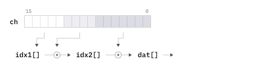
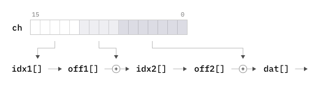

# Fast character case conversion
## ... or how to *really* compress sparse arrays

Converting strings and characters between lower and upper cases is a very 
common need.

In particular, case conversion is often used to implement *case-insensitive
comparision*, an operation that is often present on the program's fast paths 
as a part of data container lookups and content manipulation.

So it is usually desirable to make case conversions as fast as possible.

In this post we are going to look at one of the options - very fast 
case conversion using **compressed lookup tables** and also at some
options for compressing these even further.

If in rush, you can jump straight to the [Conclusion](#Conclusion).

## Lookup tables

The simplest way to do the case conversion is with a lookup table:

    const char to_lower[256] = { ... }; // lower case versions of every character
    const char to_upper[256] = { ... }; // upper case versions of every character
    
    char a = to_lower[ 'A' ];
    char Z = to_upper[ 'z' ];
    ...

This is also the fastest way. The cost of speed is the space needed to 
hold the lookup tables, the good old
[space-time tradeoff](https://en.wikipedia.org/wiki/Space%E2%80%93time_tradeoff).

If we are working with the 7-bit ASCII set, the tables will take 512 bytes.

These can be allocated and initialized statically (and therefore stored
in the executable binary) or they can be created at run-time. This is
doable because the coversion rules are trivial:

    if ('A' <= ch && ch <= 'Z') ch += 'a' - 'A'; // to lower
    if ('a' <= ch && ch <= 'z') ch += 'A' - 'a'; // to upper

In fact, for this case the benefits of using a lookup table are marginal 
at best. The above `if` construct works just as well.

## 8-bit ASCII

Case conversion for an 8-bit ASCII set depends on the 
[locale](https://en.wikipedia.org/wiki/Locale_(computer_software))
used.

In terms of speeding things up the same applies as before - either
hardcode static conversion table for each locale of interest, or
code the conversion rules and then initialize the lookup tables at
run-time.

## Unicode

Unicode is where it gets interesting.

At the time of writing the [Unicode Standard](http://www.unicode.org/versions/latest/) 
is at its 13th revision. The principle list of characters is [UnicodeData.txt](https://www.unicode.org/Public/13.0.0/ucd/UnicodeData.txt)
with its format described [here](http://www.unicode.org/L2/L1999/UnicodeData.html).
The executive summary of this fascinating read is this:

* There are around 1400 characters with lower/upper cases
* Some have more than one lower/upper case
* Some use multiple characters for one case and a single character for another

For the purpose of this post we are going to ignore #2 and #3 and 
focus on characters that covert one-to-one between their cases.

We will also focus on conversion of characters from
`0x0000 - 0xD7FF` and `0xE000 - 0xFFFF` ranges, i.e. those that 
encode as a single 16-bit word under
[UTF-16](https://en.wikipedia.org/wiki/UTF-16) encoding.

## Unicode, continued

A lookup table for the UTF-16 case requires 2 x 65536 bytes per
case, 256KB in total.

Both tables will also be *very* sparse with just 2% of a non-trivial fill.

Which brings us to the **interesting part** - is it possible to somehow 
compress these tables without sacrificing the speed of lookups?

Needless to say, the answer is Yes and one of the answers can be found
in the [Wine](https://winehq.org) project or, more specifically, in its
[unicode.h](https://github.com/wine-mirror/wine/blob/e909986e6ea5ecd49b2b847f321ad89b2ae4f6f1/include/wine/unicode.h#L93).

Pared down a bit it looks like this -

    wchar_t tolower(wchar_t ch)
    {
        extern const wchar_t casemap_lower[];
        return ch + casemap_lower[casemap_lower[ch >> 8] + (ch & 0xff)];
    }

Two bit operations, two additions and two memory references.

The `casemap_lower` table lives in
[casemap.c](https://github.com/wine-mirror/wine/blob/e909986e6ea5ecd49b2b847f321ad89b2ae4f6f1/libs/port/casemap.c)
and it is quite incredibly **just 8KB** is size:

    const wchar_t wine_casemap_lower[4122] = { ... }

Very fast, beautifully terse and, at the first glance, mysterious. Here's how it works.

## Table compression

Both `tolower` and `toupper` tables are compressed the same way, so we'll
just look at the compression of the former.

There are 1158 conversion rules and they are listed [here](tolower-table.txt).

So here's what's going on:

1. The first insight is to store **deltas** between the lower and 
   upper case codes rather than their absolute values.
  
   That is, we do `ch += lookup[...]` instead of `ch = lookup[...]`.
   
   This fills the table with 0s for all non-caseable characters, 
   creating *lots* of redundancy and making it way easier to compress.

2. Next, the full set of `wchar_t` values - all 65536 of them - 
   is split into 256 blocks, 256 characters each. Entries for 
   characters starting with 00xx (in hex) go into the first block, 
   01xx - into the second, etc.
   
       block 00 - [256 entries for values 0000 to 00FF]
       block 01 - [256 entries for values 0100 to 01FF]
        ...
       block FF - [256 entries for values FF00 to FFFF]
    
3. Once this is done, we may notice that only 17 blocks have are *not*
   completely zero-filled. These blocks are:
   
       00, 01, 02, 03, 04, 05, 10, 13, 1C, 1E, 1F, 21, 24, 2C, A6, A7, FF
   
   Remaining 239 blocks will contain just zeroes and nothing else.
   
   So we can store just these 17 blocks plus a zero-filled block and then 
   use an **index**  to map block's ID to its actual data in the table:
   
       Index                     |   Table
       --------------------------+-------------------------------------------
       block     offset          |   offset    data
       00xx  ->  0000            |   0000      [... 256 deltas ...]
       01xx  ->  0100            |   0100      [... 256 deltas ...]
       ...                       |   0200      [... 256 deltas ...] 
       05xx  ->  0500            |   ...
       06xx  ->  1200 (zeroes)   |   1100      [... 256 deltas ...] 
       07xx  ->  1200 (zeroes)   |   1200      [ 0 0 0 0 0 0 0 ...]  (zeroes)
       ...                       |
       FExx  ->  1200 (zeroes)   |
       FFxx  ->  1100            |

    This compresses table down to **4608** items (18 x 256) + the size of 
    the index. This is already excellent - around 10K instead of 128K - 
    but it can be compressed further.
    
 4. Next insight is that remaining blocks still contain a lot
    of zeroes. More specifically, one block may *end* with lots 
    of zeroes and the following one may *start* with a lot of them.
    
    Here's, for example, the end of the 0200 block -
    
        ...
        0248 | 0001 0000 0001 0000 0001 0000 0001 0000  <- last non-zeros
        0250 | 0000 0000 0000 0000 0000 0000 0000 0000
        0258 | 0000 0000 0000 0000 0000 0000 0000 0000
        ...
        02e8 | 0000 0000 0000 0000 0000 0000 0000 0000
        02f0 | 0000 0000 0000 0000 0000 0000 0000 0000
        02f8 | 0000 0000 0000 0000 0000 0000 0000 0000  <- end of the block
       
    And here's the start of the 0300 block -
    
        0300 | 0000 0000 0000 0000 0000 0000 0000 0000  <- start of the block
        0308 | 0000 0000 0000 0000 0000 0000 0000 0000
        0310 | 0000 0000 0000 0000 0000 0000 0000 0000
        ...
        0360 | 0000 0000 0000 0000 0000 0000 0000 0000
        0368 | 0000 0000 0000 0000 0000 0000 0000 0000
        0370 | 0001 0000 0001 0000 0000 0000 0001 0000  <- first non-zeros
        ...
 
    So the 0300 block can be "pulled up" to overlap with
    the 0200 block and its index entry adjusted to match.
    
    The blocks can be **squished** together if you will.
    Like so -
    
        ...
        0248 | 0001 0000 0001 0000 0001 0000 0001 0000
        0250 | 0000 0000 0000 0000 0000 0000 0000 0000
        0258 | 0000 0000 0000 0000 0000 0000 0000 0000
        0260 | 0000 0000 0000 0000 0000 0000 0000 0000
        0268 | 0000 0000 0000 0000 0000 0000 0000 0000
        0270 | 0000 0000 0000 0000 0000 0000 0000 0000
        0278 | 0000 0000 0000 0000 0000 0000 0000 0000
        0280 | 0000 0000 0000 0000 0000 0000 0000 0000
        0288 | 0000 0000 0000 0000 0000 0000 0000 0000
        0290 | 0000 0000 0000 0000 0000 0000 0000 0000 | 0300
        0298 | 0000 0000 0000 0000 0000 0000 0000 0000 | 0308 
        02a0 | 0000 0000 0000 0000 0000 0000 0000 0000 | 0310 
        02a8 | 0000 0000 0000 0000 0000 0000 0000 0000 | 0318 
        02b0 | 0000 0000 0000 0000 0000 0000 0000 0000 | 0320 
        02b8 | 0000 0000 0000 0000 0000 0000 0000 0000 | 0328 
        02c0 | 0000 0000 0000 0000 0000 0000 0000 0000 | 0330 
        02c8 | 0000 0000 0000 0000 0000 0000 0000 0000 | 0338 
        02d0 | 0000 0000 0000 0000 0000 0000 0000 0000 | 0340 
        02d8 | 0000 0000 0000 0000 0000 0000 0000 0000 | 0348 
        02e0 | 0000 0000 0000 0000 0000 0000 0000 0000 | 0350 
        02e8 | 0000 0000 0000 0000 0000 0000 0000 0000 | 0358 
        02f0 | 0000 0000 0000 0000 0000 0000 0000 0000 | 0360 
        02f8 | 0000 0000 0000 0000 0000 0000 0000 0000 | 0368 
             | 0001 0000 0001 0000 0000 0000 0001 0000 | 0370 
                                                        ...
      This little maneuver reduces our table by 112 items 
      (14 rows x 8), and that's just for these two blocks.

5. Taking the idea a bit further, we have no constraints on
   where in the table our *zero-filled* block should be.
   
   So we find a pair of blocks that have the largest 
   zero-filled overlap and we stick our zero-filled 
   block between them.
   
   Wine places this block in the 7th spot and after a 
   squish this brings table size down to **3866** items.

6. Finally, the index and the table are merged into a single array.
    
   The `casemap_lower` comprises two distinct parts. It starts
   with 256 index entries, followed by 3866 deltas, to the grand 
   total of **4122**.
    
   Going back to `towlower()` code -
    
        ...
        return ch + casemap_lower[casemap_lower[ch >> 8] + (ch & 0xff)];
    
   `casemap_lower[ch >> 8]` is the index lookup which points at the block's 
   start in the data section, followed by the retrieval of ch's delta value 
   within the block at the offset of `ch & 0xff`.
 
Nice, isn't it?

If you know the origins of this code (or its author!), let me know and 
I'll add a proper reference. It feels like something that should've been
really well researched back in the 1970s if not earlier.

# But wait...

We can do better.

## Using smaller blocks
 
Instead of splitting the original 65536 set into 256 x 256 blocks we 
can try other block sizes.

Using larger blocks will reduce the size of the index, but it will 
also cause greater %-age of blocks to contain at least one non-zero
entry.

The "squish potential" will also increase with the block size, but
the number of block pairs will be smaller.

    Block size  |  Used blocks  |   Items   |  Squish  |  Data size
    
       2048     x        8      =   16384   -   4629   =   11755                                                                     
       1024     x       10      =   10240   -   1757   =    8483    
        512     x       13      =    6656   -   1101   =    5555    
        256     x       18      =    4608   -    742   =    3866       <- the original
        128     x       28      =    3584   -    539   =    3045    
         64     x       44      =    2816   -    578   =    2238    
         32     x       55      =    1760   -    345   =    1415    
         16     x       66      =    1056   -    187   =     869
          8     x       75      =     600   -    109   =     491
          4     x       78      =     312   -     40   =     272
          2     x       81      =     162   -      0   =     162       <- unsquishable

The last column is the number of items in the table. But let's not 
forget the index:

    Block size  |  Index size  |  Data size  |  Total size
    
       2048             32     +    11755    =    11785
       1024             64     +     8483    =     8547
        512            128     +     5555    =     5683
        256            256     +     3866    =     4122       <-  the original
        128            512     +     3045    =     3557
         64           1024     +     2238    =     3262       <-  the smallest
         32           2048     +     1415    =     3463
         16           4096     +      869    =     4965
          8           8192     +      491    =     8683
          4          16384     +      272    =    16656
          2          32768     +      162    =    32930

That is, by reducing the block size to 64 items we can compress 
the table down to 3262 items (**6516 bytes**). This is ~ **21%**
reduction compared to the original of 4122 (or 8244 bytes).

The conversion function itself will look like so:

    ...
    return ch + casemap_lower[casemap_lower[ch >> 6] + (ch & 0x3f)];

## Rearranging blocks

Instead of finding the best spot for the zero-filled block, we 
can treat it as any other block and then look for the most 
squishable permutation of **all** blocks.

If we squint and abstract a bit, this search will sure look 
suspiciously like the
[Travelling Salesman Problem](https://en.wikipedia.org/wiki/Travelling_salesman_problem),
meaning no shortcuts and a rather unpleasant running time.

More specifically, the search reduces to finding (1) the heaviest
path (2) of a fixed length (3) on a bidirectional fully-meshed
weighted graph.

### Full search

For larger block sizes the number of uniques blocks will be 
quite low - 10, 13, etc. - so we can just brute-force our 
way through all possible block permutations.

A moderately optimized code can do around 50M checks per second.

With the block size of 2048 we have 8 unique blocks. That's just
40,320 permutations and the best exact squish is **5344**.

With the block size of 1024 we have 10 unique blocks. That's 
3,628,800 permutations, which take 0.1 sec to find the answer 
- **2861**.

With the block size of 512 we have 13 unique blocks. That's 
6,227,020,800 permutations or ~ 100 seconds of processing time.
Still doable and the answer is **1900**.

But with the block size of 256 - Wine's original - the number 
grows to 18! or about 49 months of processing time. No bueno.

### Heuristic search

Another approach is to try and construct "good" block sequences 
in a pseudo-intelligent way.

It just happens that underlying N x N matrices (of graph edge
weights) show some well-pronounced patterns - there are 
zero-filled rows and columns, non-zero cells are either rather 
large or fairly small with nothing in between, etc. This appears
to help getting decent results even from some rudimentary
"logical" guesses.

For example, we can pick the most squishable pair of blocks and 
then keep prepending and appending it with blocks that squish 
the best with it. This alone yields a squish of **972** for 
Wine's original 256 block size - a decent improvement over 
**742** of the original.

We can also check how *just* appending or *just* prepending 
fares in comparison. We can also *prefer* either appending or 
prepending when both yield the same improvement.

Next, we can construct our block sequence out of *multiple parts*.
That is, our sequence assembly loop will be making a choice 
between (1) adding a block to an existing part (2) merging two 
parts with a block or (3) starting yet another part from a pair
of blocks.

Once we have our sequence we can check if splitting it into 
two parts and swapping parts around would yield a better squish.
We can also see if moving an item to another spot or swapping 
it with another item would increase a squish.

These are essentially random guesses, but it turns out that for
whatever magical reason they *do* work when tried together.

In fact, they work so well that they manage to find the exact
solution for 2048, 1024 and 512 block sizes.

When used against other blocks sizes, this is the result:

    Block size    Max exact squish    Heuristic squish    Zero-block squish
    
      2048              5344                5344                4629
      1024              2861                2861                1757
       512              1900                1900                1101
       256                 ?                1244                 742
       128                 ?                1113                 539
        64                 ?                 965                 578
        32                 ?                 628                 345
        16                 ?                 387                 187
         8                 ?                 224                 109
         4                 ?                  86                  40
         2                 ?                   0                   0

### Randomized shuffling

In addition to educated guessing we can also try something even
more enlightened - randomized shuffling. Alas in an overnight 
test it didn't manage to improve upon the heuristic solutions 
for any of the block sizes.

### Summarized

Long story short, here's what block reshuffling gets us:

    Block size  |  Best squish  |    Items    |    Index    |   Total
    
       2048            5344     ->   11040    +       32    =   11072
       1024            2861     ->    7379    +       64    =    7443
        512            1900     ->    4756    +      128    =    4884
        256            1244     ->    3364    +      256    =    3620   <-  the original
        128            1113     ->    2471    +      512    =    2983
         64             965     ->    1851    +     1024    =    2875   <-  the smallest
         32             628     ->    1132    +     2048    =    3180
         16             387     ->     669    +     4096    =    4765
          8             224     ->     376    +     8192    =    8568
          4              86     ->     226    +    16384    =   16610
          2               0     ->     162    +    32768    =   32930

We are now down to **2875** items for a Wine-style lookup table, which
is **5750 bytes** or ~ **30%** smaller than the original.

## Separating the index

The table size can be reduced a bit more by noticing that we never 
have more than 256 **unique** index entries. This allows building
the index as `uint8_t[]` instead of `uint16_t[]`.

However this requires using a secondary array like so:

    // for the block size of 64
    
    uint8_t   index[1024] = { ... };
    uint16_t  offsets[44] = { ... };
    uint16_t  items[1851] = { ... };
    
    uint16_t  block_offset = offsets[ index[ ch >> 6 ] ];
    
    ch = items[block_offset + (ch & 0x3f) ];
    
Or, using in the style of Wine's merged array:

    uint8_t   index[1024]      = { ... };
    uint16_t  casemap[44+1851] = { ... };
    
    ch = casemap[ casemap[ index[ ch >> 6 ] ] + (ch & 0x3f) ];

With this reduction in place, here are the new byte counts:

    Block size  |  Index   |    Offsets + Items     |  Total bytes
    
       2048           32   +    ( 8 + 11040) x 2    =    22128
       1024           64   +    (10 +  7379) x 2    =    14842
        512          128   +    (13 +  4756) x 2    =     9666
        256          256   +    (18 +  3364) x 2    =     7020
        128          512   +    (28 +  2471) x 2    =     5510
         64         1024   +    (44 +  1851) x 2    =     4814
         32         2048   +    (55 +  1132) x 2    =     4422   <-  4.3 KB
         16         4096   +    (66 +   669) x 2    =     5566
          8         8192   +    (75 +   376) x 2    =     9094
          4        16384   +    (78 +   226) x 2    =    16992
          2        32768   +    (81 +   162) x 2    =    33254

## Recap

We are now quite good at compressing large arrays filled with a 
relatively small number of unique values.

We can also do it in two ways.

**Option A** - two 16-bit arrays, stored together, and the retrieval function 
of `arr[ idx[ch >> ...] + (ch & 0x...) ]`

    2 bit ops, 1 addition, 2 memory references

**Option B** - two 16-bit arrays, one 8-bit array and the retrieval function 
of `arr[ off[ idx[ch >> ...] ] + (ch & 0x...) ]`

    2 bit ops, 1 addition, 3 memory references

The best compression of our original `tolower` lookup table 
is **5750 bytes** with A and **4422 bytes** with B.

But we can do better still.

## Taking care of index

As we've seen, smaller blocks sizes have larger indexes. We may
also note that these indexes have very few distinct entries.

The index for the block size of 32 is **2048 entries** with only
**55** uniques and the index for the block size of 4 is **16384
entries** with only **78** uniques.

Large arrays with massive redundancy. This looks ... *familiar*.

So let's compress them too!

For the sake of some clarity, we'll refer to the index of this 
new compression as **jndex** and its blocks as **sequences**.

For each *block* size we take its index and iterate through different
*sequence* sizes looking for the most compressible option. Here are 
the results:

    Index size  |  Uniques  |  ---------------  Best compression  --------------  |
                               Jndex size  |  Seq size  |  Unique seqs  |  Items
    
         32            8              8            4            5            16
         64           10              8            8            5            27
        128           13             16            8            6            35
        256           18             32            8            8            46
        512           28             32           16            8            88
       1024           44             64           16           10           119
       2048           55            128           16           13           151
       4096           66            128           32           13           299
       8192           75            256           32           18           424           
      16384           78            256           64           18           843
      32768           81            512           64           28          1240

`Jndex size` and `Items` columns give us the compressed index size. As expected,
the index compresses *really* well.

The next question is how to encode it.

### Three arrays

One way to encode compressed index and our data table is an extension of Option 
A. This is simpler and faster to access, but it's a bit wasteful because all arrays 
are `uint16_t`.

    4 bit ops, 2 additions, 3 memory references

The byte counts are as follows:

    Index size  |       Index compressed       |  Data compressed  |  Items  |  Bytes
                    Jndex  |  Items  |  Total
    
         32           8    +    16   =    24   +       11040       =  11064     22128
         64           8    +    27   =    35   +        7379       =   7414     14828
        128          16    +    35   =    51   +        4756       =   4807      9614
        256          32    +    46   =    78   +        3364       =   3442      6884
        512          32    +    88   =   120   +        2471       =   2591      5182
       1024          64    +   119   =   183   +        1851       =   2034      4068
       2048         128    +   151   =   279   +        1132       =   1411      2822
       4096         128    +   299   =   427   +         669       =   1096      2192
       8192         256    +   424   =   680   +         376       =   1056      2112  <--  ha
      16384         256    +   843   =  1099   +         226       =   1325      2650
      32768         512    +  1240   =  1752   +         162       =   1914      3828

That is, this takes us down to **2112 bytes**.

### Five arrays

The second option is to penny-pinch bytes by using a separate `offsets` array, just
like in the Option B.

    4 bit ops, 2 additions, 5 memory references

This reduces the overall byte count as follows:

    Index size  |        Index compressed        |   Data compressed  |  Bytes
                    Jndex  |  Uniques  |  Items
    
         32           8    +    5      +     16  +  ( 8 + 11040) x 2  =  22125
         64           8    +    5      +     27  +  (10 +  7379) x 2  =  14818
        128          16    +    6      +     35  +  (13 +  4756) x 2  =   9595
        256          32    +    8      +     46  +  (18 +  3364) x 2  =   6850
        512          32    +    8      +     88  +  (28 +  2471) x 2  =   5126
       1024          64    +   10      +    119  +  (44 +  1851) x 2  =   3983
       2048         128    +   13      +    151  +  (55 +  1132) x 2  =   2666
       4096         128    +   13 x 2  +    299  +  (66 +   669) x 2  =   1923
       8192         256    +   18 x 2  +    424  +  (75 +   376) x 2  =   1618  <--  HA
      16384         256    +   18 x 2  +    843  +  (78 +   226) x 2  =   1743
      32768         512    +   28 x 2  +   1240  +  (81 +   162) x 2  =   2294

That is, with this trickery we are now down to just **1618 bytes**.

## In other words

If we prefer to use Wine-style lookup code, we can reduce the 
table size from **8244** to **5750 bytes**, a reduction of ~ **30%**.

If we are OK with using an extra memory reference, we can
shrink the table to **4422 bytes**, a reduction of ~ **45%**.

If we add two more bit operations and one addition, we can
have the table down to **2121 bytes**, a reduction of ~ **74%**.

Finally, if we splurge on 2 more memory references, the table
size can be reduced to **1618 bytes**, a reduction of ~ **80%**.

Pick your poison.

# Conclusion

Very fast case conversion of (the vast majority of) Unicode characters
can be done with a handful of CPU cycles and static precomputed lookup 
tables sized between 1.6KB to 8.6KB in size.

The 8.6KB version, courtesy of Wine:
* [casemap.c](https://github.com/wine-mirror/wine/blob/e909986e6ea5ecd49b2b847f321ad89b2ae4f6f1/libs/port/casemap.c)
* [unicode.h](https://github.com/wine-mirror/wine/blob/e909986e6ea5ecd49b2b847f321ad89b2ae4f6f1/include/wine/unicode.h#L93)

Recompressed versions of `tolower` tables:

* 5.6KB - [tolower_5750.c](tolower_5750.c)
* 4.3KB - [tolower_4422.c](tolower_4422.c)
* 2.1KB - [tolower_2112.c](tolower_2112.c)
* 1.6KB - [tolower_1618.c](tolower_1618.c)

Recompressed versions of `toupper` tables:

* 5.7KB - [toupper_5866.c](toupper_5866.c)
* 4.5KB - [toupper_4638.c](toupper_4638.c)
* 2.2KB - [toupper_2258.c](toupper_2258.c)
* 1.7KB - [toupper_1738.c](toupper_1738.c)

